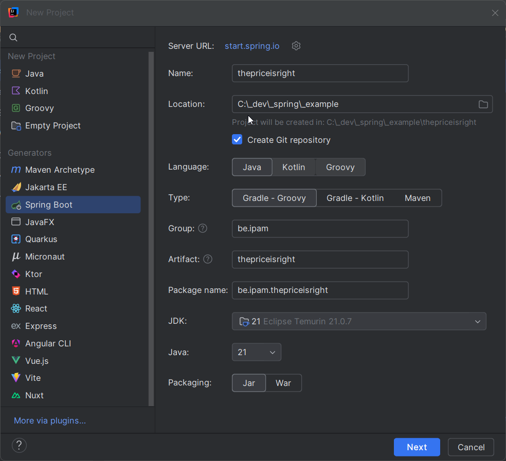
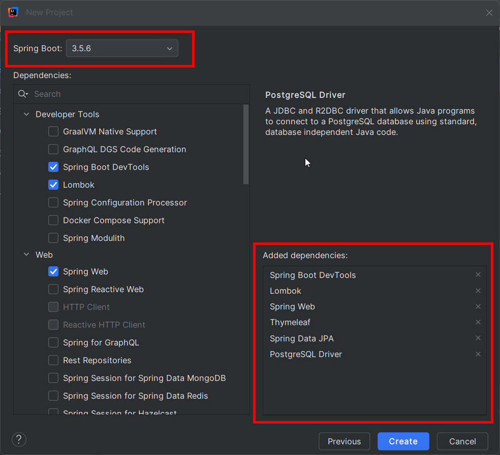
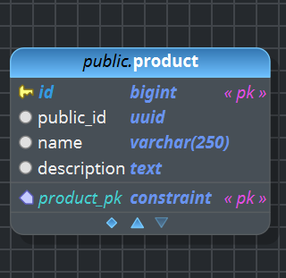

# Projet Exemple 2025

# Spring / Spring Boot

# Nouveau projet

* Nom du projet
* Emplacement et Git
* Java
* Gradle - Groovy
* group
* artifact
* jdk 21 
* java 21
* jar





* SpringBoot Dev Tools
* Spring Data JPA
* PostgreSQL Driver
* SpringWeb
* Thymeleaf
* Lombok

# Gradle
Gestion des dépendances. Utilise Maven Central pour les dépots défini par
mavenCentral()

mvnrepository.com indexe les dépots et est pratique pour la recherche mais la recherche officiel de Maven Central est search.maven.org

# DB First

DB : PostgreSQL

Password : sa123$

Utilisez pgModeler. 

Créez une table Product

| Colonne          | Type            |                   |
| :--------------- |:--------------- | :-----            |
| id               |  bigint         |  PK               |
| public_id        |  uuid           |                   |
| name             |  VARCHAR(250)   |                   |
| description      |  TEXT           |                   |



# Spring Data / JPA / Hibernate

Spring Data a été ajoué aux starters ainsi que le driver PostgreSQL. Il faut donc configurer la base de données dans `src/resources/application.properties` comme 

### Connecter la base de donnée

Connection string dans le fichier `application.properties`
```java
spring.datasource.url=jdbc:postgresql://localhost:5432/priceisright
spring.datasource.username=postgres
spring.datasource.password=sa123$
spring.jpa.hibernate.ddl-auto=validate
spring.jpa.show-sql=true
spring.jpa.properties.hibernate.format_sql=true
spring.jpa.properties.hibernate.dialect=org.hibernate.dialect.PostgreSQLDialect
```
# Model

Comme nous travaillons en DB First, il faut créer notre modèle ou le générer à partir de la base de donnée. Dans notre exemple, nous n'avons qu'une table donc il faut céer qu'une classe.

Il faut premièrement créer le packe models dans `src/main/java/be.ipam.thepriceisright.models`

```java
package be.ipam.thepriceisright.models;

...

@Entity
@Table(name = "product")
public class Product {
    @Id
    @GeneratedValue(strategy = GenerationType.IDENTITY)
    @Column(name = "id")
    private Long id;
    
    @Column(name = "name")
    private String name;
    
    @Column(name = "description")
    private String description;

    public Long getId() {
        return id;
    }

    public void setId(Long id) {
        this.id = id;
    }

    public String getDescription() {
        return description;
    }

    public void setDescription(String description) {
        this.description = description;
    }

    public String getName() {
        return name;
    }

    public void setName(String name) {
        this.name = name;
    }
}
```
Nous avons généré les getters and setters avec l'IDE. L'IDE nous signale que nous pouvons utiliser Lombok. Nous l'utiliserons dans une phase ultérieure.

Avec IntelliJ, vous pouvez créer une datasource pour vérifier la concordance entre le code et la source de données.

# Repository
Pour accéder aux données de la DB et les transformer en objets java grace à Spring Data et JPA/Hibernate nous utiliserons des repositories.

Il faut également créer un package repositories `src/main/java/be.ipam.thepriceisright.repositories` `

```java
package be.ipam.thepriceisright.repositories;

import be.ipam.thepriceisright.models.Product;
import org.springframework.data.jpa.repository.JpaRepository;

public interface ProductRepository extends JpaRepository<Product, Long> {
}

```
L'IDE IntelliJ peut vous aider à la syntaxe. Nous utiliserons le JpaRepository. Les types à fournir sont le type de l'objet du repository et le type de son id.

Nous constatons que nous utilisons une interface, nous reviendont sur ce point.

Le JPARepository hérite du CrudRepository qui comme sont nom l'indique, contient les méthode CRUD.

# Service
Pour exploiter les repositories, il faut utiliser des classes où nous coderons le business de l'application, les services.

```java
package be.ipam.thepriceisright.services;

...

@Service
class ProductService {
    
    private final ProductRepository productRepository;
    
    public ProductService(ProductRepository productRepository) {
        this.productRepository = productRepository;
    }
    
    public List<Product> getAllProducts() {
        return productRepository.findAll();
    }
    
    public Product getProductById(Long id) {
        return productRepository.findById(id).orElse(null);
    }
}
```
Nous allons utiliser les repository dans les services. Pour cela nous allons faire ce qu'on appelle une injection de dépendance. En effet la classe service dépend du repository. Nous allons passer le repository via les paramètres du constructeur plutôt que de l'instancier dans la classe. C'est l'injection de dépendance. 

Nous verrons que cette injection de dépendance ne sera pas faites par nous mais par le IoC Container. IoC signifie inversion of control ou inversion de controle. En effet, nous laisseron le IoC container instancier le reposiory et l'injecter dans le service. Cette notion est importante à comprendre car elle révelle l'effet "magique" de spring où on ne doit pas tout instancier comme vu en OOP.

Nous pouvons aussi remarquer que le paramètre est une interface et non une classe. Ceci est volontaire pour assurer un low coupling avec la dépendance. Ainsi la classe ne dépend pas de l'autre classe directement mais du contrat de l'interface.

Remarquons que pour le service nous avons utilisé une classe alors que le service va être injecté. Si nous voulions garder un low coupling nous pourions créer le service comme une interface et injecter une implémentation. `interface ProductService` et `class ProductServiceImpl implements ProductService`. 

# Controller classique / Thymeleaf
Etant donné que nous développons une application web, elle accèdera aux services via un controller qui lui renverra les données sous forme de pages web.

Annotation `@Controller`

```java
package be.ipam.thepriceisright.controllers;

...

@Controller
@RequestMapping("/web/products")
class ProductController {
    private final ProductService productService;

    public ProductController(ProductService productService) {
        this.productService = productService;
    }

    @GetMapping
    public String listProducts(Model model) {
        model.addAttribute("products", productService.getAllProducts());
        return "products";
    }

    @GetMapping("/{id}")
    public String viewProduct(@PathVariable String id, Model model) {
        model.addAttribute("product", productService.getProductById(Long.valueOf(id)));
        return "product-details";
    }
}
```
La page html est basée sur le template `nameoftemplate.html` se trouvant dans `/src/resources/templates/`

```html
<!DOCTYPE html>
<html xmlns:th="http://www.thymeleaf.org">
<head><title>Liste des produits</title></head>
<body>
<h1>Liste des produits</h1>
<ul>
    <li th:each="u : ${products}">
        <a th:href="@{/web/products/{id}(id=${u.id})}"><span th:text="${u.id}"></span></a> -
        <span th:text="${u.name}"></span>
        (<span th:text="${u.description}"></span>)
    </li>
</ul>
</body>
</html>
```
```html
<!DOCTYPE html>
<html xmlns:th="http://www.thymeleaf.org">
<head><title>Détails du produit</title></head>
<body>
<h1>Détails du produit</h1>
<p>ID: <span th:text="${product.id}"></span></p>
<p>Name: <span th:text="${product.name}"></span></p>
<p>Description: <span th:text="${product.description}"></span></p>
</body>
</html>
```
# Rest Controller
Si les données ne doivent pas être présentée à un humain mais exploitée par une autre application, nous pouvons envoyer les donnée à la machine dans un format stucturé par exemple le json. Nous utiliserons dans ce cas un REST Controller

Annotation `@RestController`

```java
package be.ipam.thepriceisright.controllers;

...

import java.util.List;

@RestController
@RequestMapping("/api/products")
class ProductRestController {
    private  final ProductService productService;

    public ProductRestController(ProductService productService) {
        this.productService = productService;
    }

    @GetMapping
    public List<Product> findAll() {
        return productService.getAllProducts();
    }

    @GetMapping("/{id}")
    public Product findById(@PathVariable("id")Long id) {
        return productService.getProductById(id);
    }
}
```
# SPA (Single Page Application)
Dans le cas d'une Single Page Application, nous utiliserons une API qui sera appelée via les des RESTControllers qui nous fournirons des réponse dans le format Json.

La séquence d'initialisation d'une tel application est la suivante.
* Le navigateur récupère les fichier d'initialisation de l'application
    * Fichier HTML
    * Fichier CSS
    * Fichier JS
* La page est chargée et le code JS est exécuté par le navigateur.
* Le programme lance des requètes à l'API via les controllers.
* Le programme récupère les réponses en Json.
* Le programme converti les réponse en JS.

Ce type d'application peut être développé en utilisant javascript et Ajax mais il est préférable d'utiliser un framwork tel que Angular ou React.

# Exercice
Prenez une table de votre base de données et créer l'application Spring pour en afficher les données.

# Lombok

Lombok permet de générer du code répétitif. (Boilerplate)

* Getters
* Setters
* Constructeurs
* toString()
* equals()

|Annotation	|Description|
|----|----|
|@Getter	|Génère tous les getters|
|@Setter	|Génère tous les setters
|@NoArgsConstructor|	Génère un constructeur vide
|@AllArgsConstructor|	Génère un constructeur avec tous les champs
|@RequiredArgsConstructor	|Constructeur pour les champs final ou @NonNull
|@ToString|	Génère une méthode toString()
|@EqualsAndHashCode|	Génère equals() et hashCode()
|@Builder|	Fournit un pattern builder fluide
|@Data	|Équivaut à @Getter + @Setter + @ToString + @EqualsAndHashCode + @RequiredArgsConstructor
|@Value|	Version immuable (champs final, pas de setters)

* Pour JPA toujours mettre le @NoArgsConstructor
* Eviter le @Data
* Le @Builder permet de construire un nouvel objet facilement. 

# JPA Relationships

## @OneToMany / @ManyToOne

```java
//Product.java
@Entity
@Table(name = "product")
public class Product {
    @Id
    @GeneratedValue(strategy = GenerationType.IDENTITY)
    private Long id;

    @Column(nullable = false, unique = true)
    private String label;

    @OneToMany(mappedBy = "product")
    private Set<Price> prices = new HashSet<>();
}
```
Lire "mapped by" champs "product" dans la classe "relationship owner" Price. La classe "owner" étant la classe dont la table correspondante contient la PK.

```java
@Entity
@Table(name = "price")
public class Price {
    @Id
    @GeneratedValue(strategy = GenerationType.IDENTITY)
    private Long id;

    @ManyToOne
    @JoinColumn(name = "product_id", nullable = false)
    private Product product;

    @Column(nullable = false, precision = 10, scale = 2)
    private BigDecimal value;
}
```

## @ManyToMany

```java
//Shop.java
@Entity
@Table(name = "shop")
public class Shop {
    @Id 
    @GeneratedValue(strategy = GenerationType.IDENTITY)
    private Long id;

    @Column(nullable = false, unique = true, length = 150)
    private String name;

    @ManyToMany
    @JoinTable(
        name = "shop_product",
        joinColumns = @JoinColumn(name = "shop_id"),
        inverseJoinColumns = @JoinColumn(name = "product_id")
    )
    private Set<Product> products = new HashSet<>();
}
```
Pour le @ManyToMany, nous choisissons le owner

```java
// Product.java
@Entity
@Table(name = "product")
public class Product {
    @Id 
    @GeneratedValue(strategy = GenerationType.IDENTITY)
    private Long id;

    @Column(nullable = false, unique = true, length = 150)
    private String label;

    @ManyToMany(mappedBy = "products")
    private Set<Shop> shops = new HashSet<>();
}
```

## @OneToOne

```java
@Entity
@Table(name = "shop")
public class Shop {
    @Id
    @GeneratedValue(strategy = GenerationType.IDENTITY)
    private Long id;

    @Column(nullable = false, unique = true)
    private String name;

    @OneToOne
    @JoinColumn(name = "head_office_address_id")
    private HeadOfficeAddress headOfficeAddress;
}
```

```java
@Entity
@Table(name = "head_office_address")
public class HeadOfficeAddress {
    @Id
    @GeneratedValue(strategy = GenerationType.IDENTITY)
    private Long id;

    private String street;
    private String city;
    private String postalCode;
    private String country;

    @OneToOne(mappedBy = "headOfficeAddress")
    private Shop shop;
}
```
# Code First avec Hibernate pour le développement

``spring.jpa.hibernate.ddl-auto=create``
| Mode | Action
|---|---|
| none | Ne fait rien |
| validate| Vérifie concordance au démarrage |
| update | Modifie au démarrage mais garde les donnés|
| create | Supprime et recrée
| create-drop | create + suppression à la fermeture de l'application|

# DTO

Un DTO Data Tranfer Object est un objet utilisé pour transférer des données entre les couche de l'application. Ainsi les objet du modèle utilisé dans la couche service sont transformé en DTO. Ces DTO sont utilisés dans les controllers pour être renvoyés vers le client. L'utilisation du DTO permet de transférer uniquement les données nécessaires.

Ces objets sont converti en JSON dans la réponse des requètes web et inversément les données en JSON seront converties en DTO lors d'une requète transmise à la méthode d'un controlleur.

# Mapper

Pour converir les objets entité vers les DTO, nous itiliserons des mappers. Pour faciliter le développement nous utiliserons la librairie Mapstruct.

## Ajout de Mapstruct à Gradle
```java
implementation 'org.mapstruct:mapstruct:1.6.3'
annotationProcessor 'org.mapstruct:mapstruct-processor:1.6.3'
```

Nous utiliserons JPABuddy pour la génération des mappers Mapsruct.

# JPABuddy

# Postman

# API REST

| Action                   | Méthode HTTP | URL                  | Statut attendu | Description                       |
| ------------------------ | ------------ | -------------------- | -------------- | --------------------------------- |
| Lire tous les produits   | `GET`        | `/api/products`      | 200 OK         | Retourne la liste                 |
| Lire un produit          | `GET`        | `/api/products/{id}` | 200 / 404      | Retourne un produit               |
| Créer un produit         | `POST`       | `/api/products`      | 201 Created    | Ajoute un produit                 |
| Modifier (totalement)    | `PUT`        | `/api/products/{id}` | 200 / 404      | Met à jour entièrement            |
| Modifier (partiellement) | `PATCH`      | `/api/products/{id}` | 200 / 404      | Met à jour un ou plusieurs champs |
| Supprimer                | `DELETE`     | `/api/products/{id}` | 204 / 404      | Supprime le produit               |

# OpenAPI (Swagger)

Ajouter la dépendance à gradle

```java
dependencies {
    implementation 'org.springdoc:springdoc-openapi-starter-webmvc-ui:2.8.13'
}
```

Pour ajouter la config, créez un bean de confiuration

```java
@Configuration
public class OpenApiConfig {

    @Bean
    public OpenAPI priceIsRightApi() {
        return new OpenAPI()
                .info(new Info()
                        .title("The Price Is Right API")
                        .description("API REST pour gérer les produits et leurs prix")
                        .version("1.0.0"));
    }
}
```

Pour accéder à OpenAPI :

Swagger UI http://localhost:8080/swagger-ui/index.html

OpenAPI JSON  http://localhost:8080/v3/api-docs

OpenAPI YAML http://localhost:8080/v3/api-docs.yaml

Des information pour la documentation peut être ajoutée via des annotation dands le controller

```java
@Tag(name = "Products", description = "Endpoints CRUD pour les produits")

@Operation(
    summary = "Récupère tous les produits",
    description = "Retourne la liste complète des produits enregistrés dans la base de données."
)

@ApiResponses({
    @ApiResponse(responseCode = "200", description = "Liste de produits renvoyée avec succès"),
    @ApiResponse(responseCode = "500", description = "Erreur interne du serveur")
})
```
